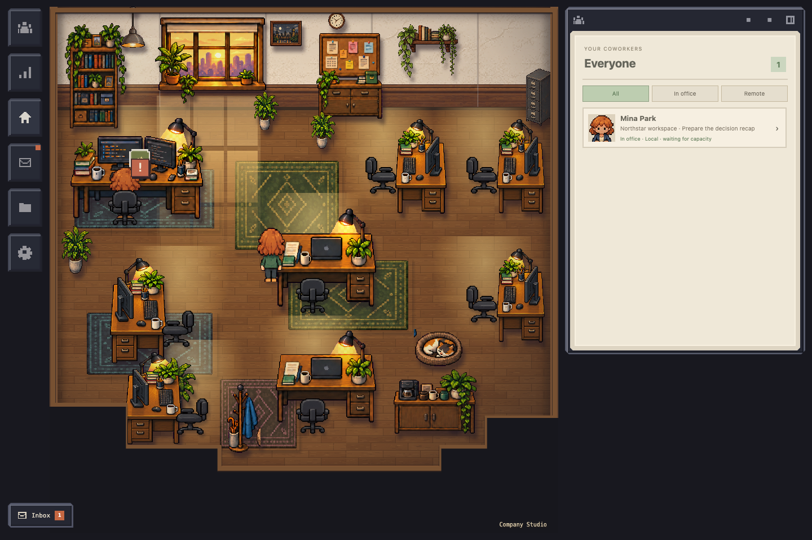

# Pixel Harness

Pixel Harness is a local-first pixel office for coordinating coding work through a user's own Codex connection. It gives projects persistent coworkers, scoped task folders, explicit plans and decision gates, a task board, a native-terminal session view, and reproducible demo evidence.

It is a browser-first development project for macOS and Node 26+. It is not a hosted service, a packaged desktop application, or an autonomous multi-agent scheduler.



## What it demonstrates

- A local Node service and SvelteKit UI with loopback-only, token- and origin-guarded requests.
- Persistent projects, assigned coworkers, task threads, plans, decision records, delivery records, and recovery state in a local SQLite database.
- Explicit task scopes and approval gates before Codex execution or delivery; saved session history is visibly distinct from an attached native terminal.
- Reproducible fixture and browser rehearsals for the Studio, task workspace, board, Inbox, reduced-motion controls, and responsive layouts.

See the [project specification](MILESTONES.md), [execution ledger](docs/execution/STATUS.md), and [demo evidence](docs/evidence/README.md) for the implemented scope and its verification record.

## Quick start

Prerequisites: macOS, Node 26 or newer, npm, and a current Chromium-based browser. Real Codex execution also requires the Codex CLI installed and authenticated locally.

```sh
npm install
npm run dev
```

The service prints a one-time local URL containing a fragment token. Open that exact URL in your browser. By default, all runtime data is written to `.pixel-harness/`, which is ignored by Git.

To start from the polished, disposable demo state:

```sh
npm run demo:fixture
npm run dev
```

For a non-provider browser rehearsal, run `npm run demo:rehearse`. The separate `npm run demo:rehearse:live` command attaches a real local Codex terminal and should only be used with that local access intentionally available.

## Development checks

```sh
npm run check:service
npm test
npm run check
npm run test:office
npm run build
```

## Privacy and execution boundaries

Pixel Harness does not persist provider tokens, cookies, private keys, or source-file contents as task evidence. Local folder paths and task metadata are stored in the local database; do not share a personal runtime database. The checked-in demo can always be regenerated with `npm run demo:fixture`.

The app never starts a Codex task simply by creating or assigning one. A current plan must be explicitly approved, selected folders must be available, and execution is launched by an explicit local action. Delivery and merging are separate, explicit operations.

## Status

Packets 00 through 3H are implemented and have recorded evidence. The next planned capabilities—second-harness isolation, fallback, parallel scheduling, optional Coder support, and broader release work—are intentionally not started. The UI is usable for continuing development; future recording approval and final visual polish remain separate from implementation acceptance.

## License

[MIT](LICENSE)
